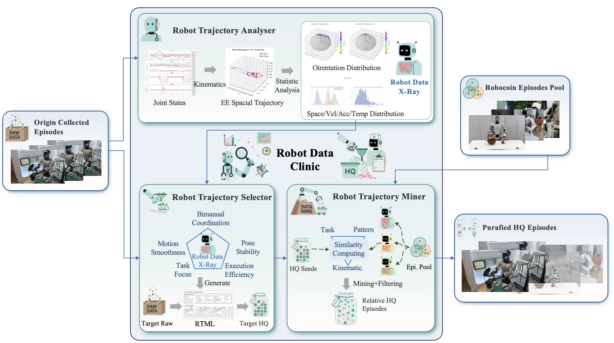
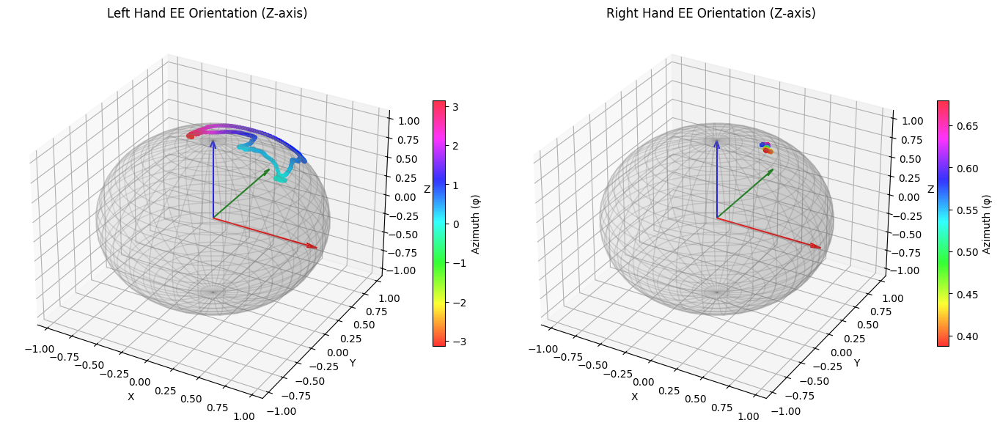
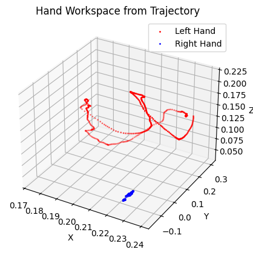
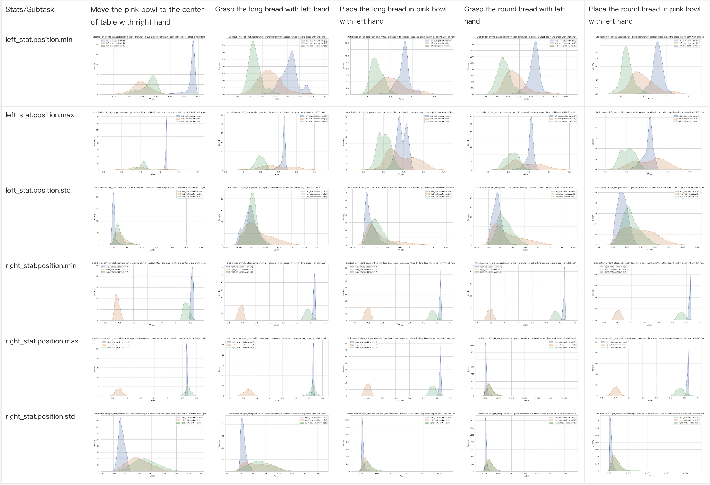

## 🤖 Robot Data Clinic (RDC)

为解决机器人操作数据缺乏统一质量评价标准的问题，我们提出了 **机器人轨迹规范标记语言（RTML）** —— 一种面向轨迹质量的领域特定语言（DSL）。  
RTML 将经验性质量维度（如平滑性、稳定性、协同性等）转化为**可计算、可配置、机器可读**的规则，支持**全局约束**与**子任务级定制**。

基于 RTML，我们构建了 **Robot Data Clinic (RDC)** —— 一个端到端的轨迹数据评估与增强系统，实现“**诊断 → 筛选 → 增益**”闭环：




### 🔍 1. 轨迹分析器（Analyser）

- 输入原始轨迹数据，输出多维度统计特征（位姿、速度、加速度、时间等）
- 生成“**机器人数据 X 光**”（Robot Data X-Ray），可视化末端执行器的空间分布、朝向异常等模式
- 为后续筛选建立客观质量基线

### ✅ 2. 轨迹筛选器（Selector）

- 基于 RTML 规则库自动过滤低质量轨迹
- 支持两级约束：
  - **全局约束**：适用于所有任务的基础质量要求（如最大速度、加速度）
  - **子任务约束**：针对特定操作阶段的精细化规则（如工作空间边界、空闲臂运动限制）
- 按五大质量维度严格筛选：
  - 运动平滑
  - 位姿稳定
  - 双臂协同
  - 任务专注
  - 执行效率

---

## 🚀 快速开始

### 创建环境

```bash
conda create -n rdc python=3.10
conda activate rdc
conda install pinocchio -c conda-forge
pip install -r requirements.txt
```

---

### 📊 robot_trajectory_analyser

#### 生成 X-Ray 统计文件

基于 CoRobot 标注的子任务（subtask），计算多维度统计指标，生成每个 episode 对应的 X-Ray 文件：

```bash
cd RTML_release/src/robot_trajectory_analyser
python compute_subtask_stats.py --repo_path /media/woxue/garbase/eai_datasets/lerobot/unitree_G1_BAAI_v2/unitree_g1_plate_storage_doll
```

> 💡 你也可以在 `compute_subtask_stats.ipynb` notebook 中交互式调试各组件，并可视化单个 episode 的末端位姿变化和空间轨迹：

| 末端执行器运动位姿分布（球形图） | 末端执行器空间运动轨迹 |
|-------------------------------|------------------------|
|   |  |

#### 多维度统计可视化

指定子任务和统计维度，生成可视化图像：

```bash
cd RTML_release/src/robot_trajectory_analyser
python visualize_subtask_stats.py \
  --subtask "Grasp the long bread with left hand" \
  --path /path/to/xray \
  --field left_stat.orientation.std \
  --output results/xray_vis.png
```

批量生成所有子任务及所有统计维度的分布图：

```bash
cd RTML_release/src/robot_trajectory_analyser
python __scripts/visualize_subtask_batch.py \
  --dataset_path /path/to/xray \
  --output_root results/xray_vis_all
```

> 示例输出：
>
> | workspace 维度 | velocity 维度 |
> |----------------|---------------|
> |  |  |

---

### 🧪 robot_trajectory_selector

#### 编写 RTML 文件

结合统计可视化结果和子任务特点，编写 RTML 配置文件：

- 在 `global_constraints` 中设置全局约束（与子任务无关的基本质量要求）：

```yaml
global_constraints:
  velocity:
    linear:
      max: 0.5
      mean_max: 0.3
  acceleration:
    linear:
      max: 12.0
```

- 在 `stages` 中为每个子任务设置精细化约束，例如工作空间、空闲臂限制等：

```yaml
stages:
  - id: "move_bowl_right"
    match_subtask: "Move the pink bowl to the center of table with right hand"
    constraints:
      workspace:
        right:
          min: [0.10, -0.40, 0.10]
          max: [0.25, -0.20, 0.30]
      velocity:
        linear:
          mean_max: 0.10
          std_max: 0.08
      idle_arm:
        arm: "left"
        velocity_linear_mean_max: 0.05
      temporal:
        duration_min: 2.0
        duration_max: 6.0
```

> 📄 完整示例见：`RTML_release/src/robot_trajectory_selector/RTML_demo.yaml`

#### 过滤高质量数据

使用 RTML 文件解析规则，筛选高质量轨迹：

```bash
python robot_trajectory_selector.py \
  --input /mnt/phecda/woxue/projects/RobotDataFactory/RTML_release/sample_data/xray \
  --rtml RTML_demo.yaml \
  --output_file ../../results/hq_episodes.txt
```
